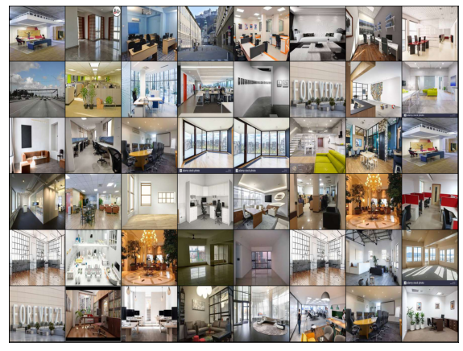
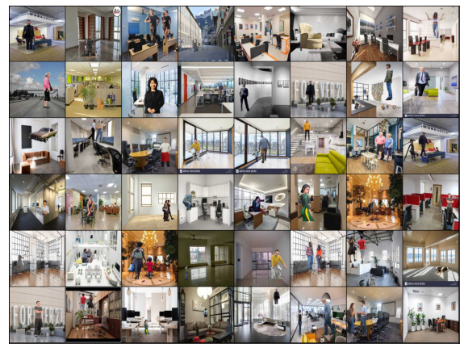
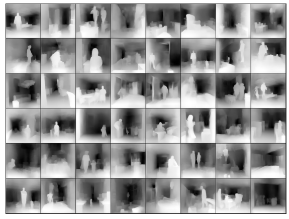
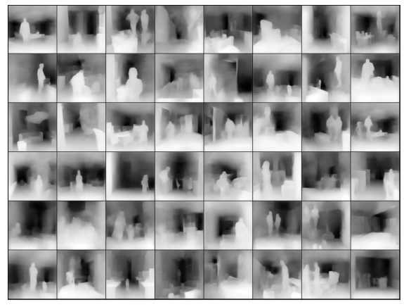
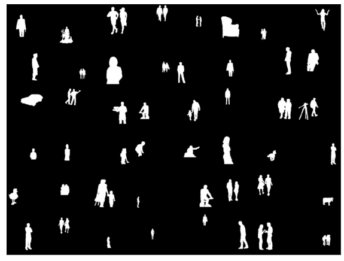
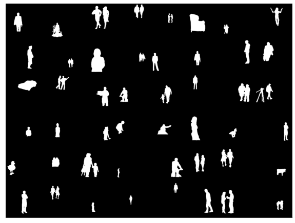

# Depth and Mask Estimation
The main challenge of this assignment was data creation which is already explained in the A part of the assignment. 

## Model
For selecting a model i have went through different models, A Customized version of Unet is used here, its becuase Unet giving good result for medical image segmentation and its very simple as well. Original Unet will be very heavy and require more time and resources for training and it returns only single image as output. I have tested the performance of Unet on depth and mask dataset individually and was able to get good result. Few changes are made inorder to accespt two images as input and produce two images as output and also reduced the number of channels in each layer for reducing the total number of parameters. This variant of Unet became a perfect companian for this problem.

## Optimizer
I have tested the code with Two optimizers, RMSprop and SGD. Both the models giving good results. I have checked the performance of these optimizers in various problem and at last stick to SGD. 

## Scheduler
i have tested with ReduceLROnPlateau and StepLR and finaly using ReduceLROnPlateau, ReduceLROnPlateau is choosing learning rate intelligently. it reducing the learning rate by a factor once learning stagnates rather than step decrement.

## criterion
SSIM and BCEWithLogitsLoss are tested and SSIM is using since it takes structural similariy for calculating loss. 

## Batch Size
Tested with various btach sizes,higher batch size resulted in crashing of colab due to overflow of memory. After many trial and errors batch size is fixed to 48.

## Augmentation
I was able to get good result without any augmentation statergy. I dont think augmentation can make huge variation in result.

## Training 
Training Planned for 10 epochs, but only run for 7 epochs due to colab ussage limitations. ***Each epoch took around 1 hour 1 minute  for training, and 15 minutes for testing***
Logs are kept very minimal in order to avoid ram overflow and browser crasshing issues. Losses will be displayed during training as Logs. Inorder to observe the testing performance at the end of each epoch Predction of Mask, Depth and Depth ground truths are displayed.
After training of each epoch, the weights are being stored in google drive, this is to resume training during crashing. since i was able to get good result within 7 epochs i havent resumed training after 7 epochs. 

## Background Image

## Foreground + Background Image

## Depth

### Ground Truth

### Prediction

## Mask

### Ground Truth

### Prediction

### ***Colab: https://github.com/roshantac/EVA4/blob/master/Assignment15/B/Depth_and_Mask_Extraction.ipynb ***

